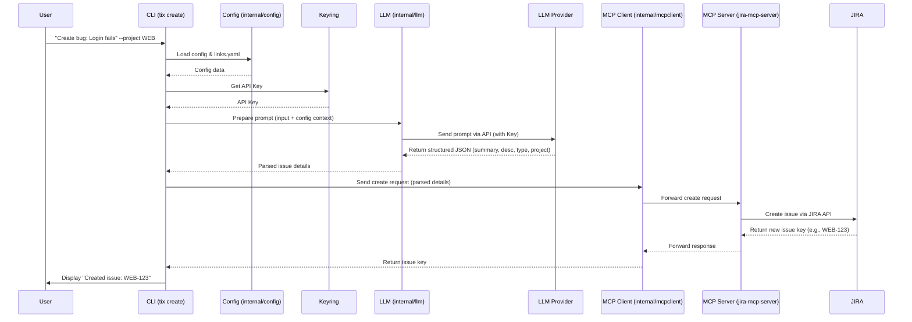

# docs/architecture.md

This document outlines the high-level architecture of the `ticketron` CLI tool.

## Overview

`ticketron` is a command-line interface (CLI) tool built in Go. It leverages a Large Language Model (LLM) to interpret natural language commands for creating JIRA issues and uses a dedicated MCP (Model Context Protocol) server (`jira-mcp-server`) to interact with the JIRA API.

```mermaid
graph TD
    subgraph User Interaction
        CLI[CLI Interface (tix)]
    end

    subgraph Ticketron Core
        Cmd[Commands (Cobra)]
        Cfg[Config Loading (internal/config)]
        LLM[LLM Interaction (internal/llm)]
        MCP[MCP Client (internal/mcpclient)]
    end

    subgraph External Services
        LLM_Provider[LLM API (e.g., OpenAI)]
        MCP_Server[jira-mcp-server]
        JIRA[JIRA API]
        Keyring[OS Keychain]
    end

    CLI -- User Input --> Cmd
    Cmd -- Needs Config --> Cfg
    Cmd -- Needs LLM Processing --> LLM
    Cmd -- Needs JIRA Action --> MCP
    Cmd -- Needs API Key --> Keyring
    LLM -- API Call --> LLM_Provider
    MCP -- MCP Request --> MCP_Server
    MCP_Server -- JIRA API Call --> JIRA

    Cfg -- Reads --> Filesystem[~/.ticketron/*]
    LLM_Provider -- LLM Response --> LLM
    JIRA -- JIRA Response --> MCP_Server
    MCP_Server -- MCP Response --> MCP
    Keyring -- Reads/Writes --> SecureStorage[(OS Specific)]
```
*(Diagram slightly updated to reflect Keyring usage)*

## Components

1.  **CLI Interface (`cobra`)**:
    *   Built using the `cobra` library.
    *   Provides the main entry point (`tix`) and subcommands (`create`, `search`, `config`, `context`, `completion`, `version`).
    *   Handles command-line argument parsing and flag management.
    *   Located in the `ticketron/cmd/` directory.

2.  **Configuration Loading (`internal/config`)**:
    *   Manages loading configuration from YAML files located in `~/.ticketron/`.
        *   `config.yaml`: Stores general settings like the configured LLM provider, MCP server URL, default log level. (API keys are stored securely using the OS keychain via `tix config set-key` or environment variables).
        *   `links.yaml`: Stores mappings between keywords/hints and JIRA project keys/issue types to aid the LLM.
    *   Uses the `viper` library for loading and accessing configuration values.
    *   Provides functions to locate, show, and initialize configuration files (`tix config` subcommands).
    *   Handles secure API key retrieval via `go-keyring` or environment variables.

3.  **LLM Interaction (`internal/llm`)**:
    *   Responsible for communicating with the configured LLM provider (supports OpenAI, potentially others via interface).
    *   **Prompt Construction**: Takes user input (e.g., from `tix create`) and combines it with context from the configuration (project mappings, issue types) and potentially `context.md` to create a detailed prompt.
    *   **API Call**: Sends the constructed prompt to the configured LLM API.
    *   **Response Parsing**: Parses the JSON response from the LLM to extract structured data, such as the suggested JIRA issue summary, description, project key, and issue type.

4.  **MCP Client (`internal/mcpclient`)**:
    *   Acts as the client for the `jira-mcp-server`.
    *   Takes the structured data (obtained from the LLM for `create`, or JQL for `search`) and sends it as a request to the `jira-mcp-server`.
    *   Handles HTTP communication with the MCP server, abstracting the direct JIRA API interaction away from the main `ticketron` tool.
    *   Receives responses from the MCP server (e.g., the created issue key or search results) and passes them back to the relevant command for display to the user.

## `create` Command Workflow

The `tix create` command follows this general flow:


*(Sequence diagram updated to reflect Keyring usage)*

This architecture decouples the core CLI logic from the specifics of LLM interaction and JIRA API communication, promoting modularity and maintainability.